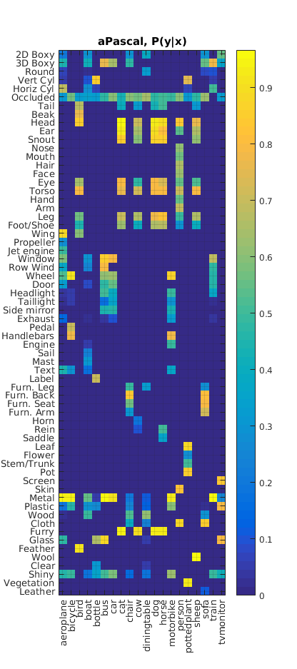

<script type="text/javascript" src="http://cdn.mathjax.org/mathjax/latest/MathJax.js?config=default"></script>


#### Co-occurence Matrix: ####


```python
imagesc(co_matrix)
ax = gca;
% ax.YLim = [0.5 64.5];
ax.YTick = 1:64;
ax.YTickLabel = {'2D Boxy','3D Boxy','Round','Vert Cyl','Horiz Cyl','Occluded','Tail','Beak','Head','Ear','Snout','Nose','Mouth','Hair','Face','Eye','Torso','Hand','Arm','Leg','Foot/Shoe','Wing','Propeller','Jet engine','Window','Row Wind','Wheel','Door','Headlight','Taillight','Side mirror','Exhaust','Pedal','Handlebars','Engine','Sail','Mast','Text','Label','Furn. Leg','Furn. Back','Furn. Seat','Furn. Arm','Horn','Rein','Saddle','Leaf','Flower','Stem/Trunk','Pot','Screen','Skin','Metal','Plastic','Wood','Cloth','Furry','Glass','Feather','Wool','Clear','Shiny','Vegetation','Leather'};    
ax.XTick = 1:20;   
ax.XTickLabel = {'aeroplane','bicycle','bird','boat','bottle','bus','car','cat','chair','cow','diningtable','dog','horse','motorbike','person','pottedplant','sheep','sofa','train','tvmonitor'};    
ax.XTickLabelRotation = 90;
ax.Title.String = 'aPascal, P(y|x)';
ax.XGrid = 'on';
ax.YGrid = 'on';
```
