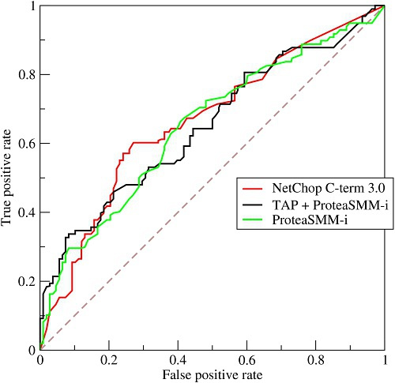
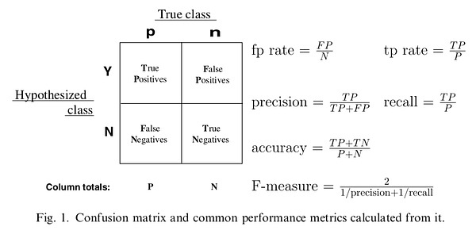
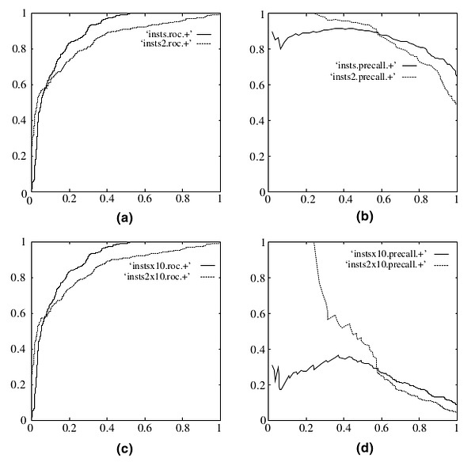

### ROC（Receiver Operating Characteristic ###

In signal detection theory, a receiver operating characteristic (ROC), or simply ROC curve, is a graphical plot which illustrates the performance of a binary classifier system as its discrimination threshold is varied

For a binary classificatio, the ROC Curve is illustrated as:

The x-axis and y-axis of the above figure is calcuated as:

Therefore, the more the curve near the above left point, the better performance the classifier achieves.

既然已经这么多评价标准，为什么还要使用ROC和AUC呢？因为ROC曲线有个很好的特性：当测试集中的正负样本的分布变化的时候，ROC曲线能够保持不变。在实际的数据集中经常会出现类不平衡（class imbalance）现象，即负样本比正样本多很多（或者相反），而且测试数据中的正负样本的分布也可能随着时间变化。下图是ROC曲线和Precision-Recall曲线[^5]的对比。

在上图中，(a)和(c)为ROC曲线，(b)和(d)为Precision-Recall曲线。(a)和(b)展示的是分类其在原始测试集（正负样本分布平衡）的结果，(c)和(d)是将测试集中负样本的数量增加到原来的10倍后，分类器的结果。可以明显的看出，ROC曲线基本保持原貌，而Precision-Recall曲线则变化较大。

### F1 score ###

F1 score is a harmonic mean of precision and recall. $$F_1=2\cdot\frac{precision \cdot recall}{precision+recall}$$

### Micro-averaged F-Measure ###

[Micro-averaged F1](http://citeseerx.ist.psu.edu/viewdoc/download?doi=10.1.1.104.8244&rep=rep1&type=pdf "original paper") for a binary or multiclass problem is identical to plain old accuracy. In micro-averaging, F-measure is computed globally over all category decisions. precision and recall are obtained by summing over all individual decisions:

$$Recall=\frac{\sum_{i=1}^M TP_i}{\sum_{i=1}^M(TP_i+FP_i)}, Precision=\frac{\sum_{i=1}^M  TP_i}{\sum_{i=1}^M(TP_i+FN_i)}.$$

$$F_{micro}=2\cdot\frac{precision \cdot recall}{precision+recall}$$

Micro-averaged F-measure gives equal weight to each document and is therefore considered as an average over all the document/category pairs. It tends to be dominated by the classifier’s performance on common categories.

### Macro-F1 ###

Macro-averaged recall, also known as balanced accuracy, is popular and more useful than macro-averaged F1 for a binary problem.

$$F_i=2\cdot\frac{precision_i \cdot recall_i}{precision_i+recall_i}$$

$$F_{macro}=\frac{\sum_{i=1}^MF_i}{M}$$
