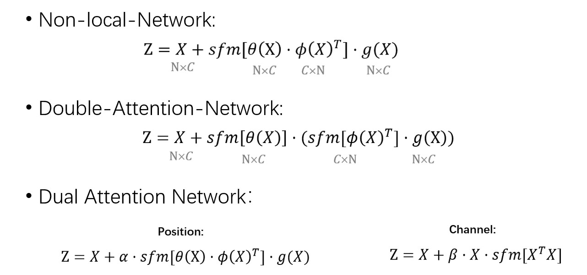

# Global Context Modeling in Semantic Segmentation

---

From last year, my main research focused on medical image analysis. In particular, I developed algorithms to diagnose stroke symptom and traumatic brain injury on CT scans. The main correlated technique is semantic segmentation which is one of the three main tasks in computer vision. 

Most of the semantic segmentation papers mainly focused on how to model the context information without losing the details. Therefore, I listed some related works and compare them in a unified framework:

* 2018-CVPR-Non-local Neural Networks
* 2018-NIPS-Double Attention Networks
* 2019-CVPR-Dual Attention Network for Scene Segmentation

